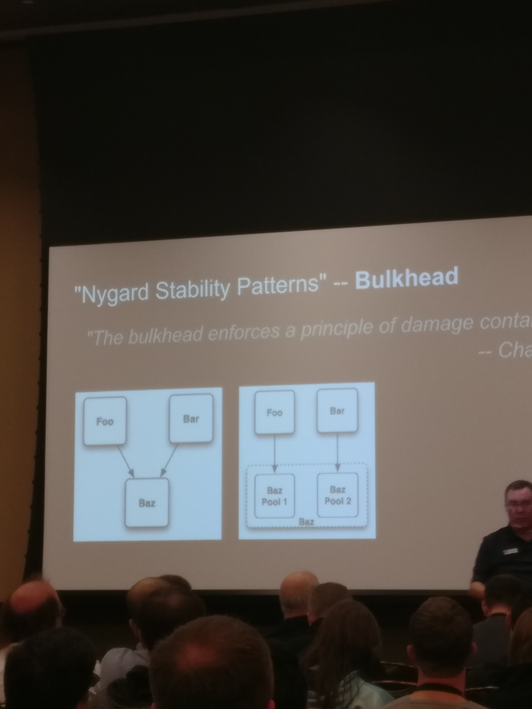

# Learning the Three Types of Microservices
## Overview
- Programming the Network
- Microservices
- Three Types of Microservice Components
- Nygaard's Stability patterns

## (The Challenges of) Programming the Network
> 1. There is no simultaneity at a distance
> 1. by the time you see a distant object, it may have changed
> - Pat Helland, 2005

[The Fallacies of Distributed Computing](https://en.wikipedia.org/wiki/Fallacies_of_distributed_computing)

1. The network is reliable.
1. Latency is zero.
1. Bandwidth is infinite.
1. The network is secure.
1. Topology doesn't change.
1. There is one administrator.
1. Transport cost is zero.
1. The network is homogeneous.

## ~~Unix Operating Principles~~ Microservices Characteristics
1. Make each program do one thing well
1. Expect the output of one program to be the input of another
1. Designed to be tried early
1. Use tools to lighten programming task

**tl;dr Loosely coupled components running in an engineered system**
- teams can release when they want to

## The Three Types of Microservices
1. Stateless
2. Persistence (System of record)
3. Aggregator connects persistence <-> stateless

### The Stateless Microservice
- Simple processors
    -  i.e. Math calculations (time value of money)
- **No dependence on any other service**
- **No local data stored / disk IO**
- Very, very easy to scale
- No shared state
- Replaceable
- Common infrastructure: Ephemeral computing (i.e. AWS Lambda)

### The Persistent Microservice
- Simple (local) storage (reads/writes)
- Disk I/O dependent
- Possibly VM / 1U dependent
- Not the easiest to implement
    - gotta deal with data availability/copying
- Easy to scale for reads
    - I.E. using CQRS
- No cross-service [two-phase commits](https://dzone.com/articles/xa-transactions-2-phase-commit) (saga)
- Common infrastructure:  Durable Storage (i.e. Amazon S3)

#### Stabilization concerns
1. add fail fast
1. add timeout
1. add circuitbreaker
1. steady-state

### The Aggregator Service
- depends on other (usually distant) services
- **Network dependent**
    - Touches lots of systems far-away systems over time.
- usually Disk I/O dependence, but not always
- Most Challenging to create, as it has constraings from other 2 services
- Able to switch between parallel and sequential processing, depending on needs.
- Timing is usually a big concern in this system
    - I.E. What is the order of operations to update a user order information?

#### Stabilization concerns
1. Fail fast
1. Timeout
1. Circuitbreaker
1. Steady-state
1. Handshaking
1. Bulkhead

## Nygard Stability Patterns 
> Bugs will happen. They cannot be eliminated. They must be survived.
> - Michael T. Nygard

- Timeout
- Circuit Breaker
- Bulkhead
- Steady State
- Fail Fast
- Handshake
- Cache

### Timeout
- A mechanism to _stop_ waiting for an answer

### Circuit Breaker
- A way to automatically degrade functionality when the system is under stress
- useful in proxy server/load balancer for routing traffic away from over-utilized servers

### Bulkhead / Blast zone
- Enforces a principle of damage containment

### Steady State
- The system should be able to run indefinitely without human intervention
- Avoid fiddling
- purge data w/ app logic
- limit caching
- Roll the logs

### Handshake
- Allows the server to protect itself by throttling its own workload.
- i.e. Healthchecking

## Fail-fast
- if the system can determine **in advance** that it will fail at an operation, it is **always** better to fail fast.

## Cache
- Can reduce the load on the server and cut response times to a fraction of what they would be without caching.

## Resources
- [www.apiacademy.co](www.apiacademy.co)
- [https://microservices.io/](https://microservices.io/)
- [Microservice Architecture](http://shop.oreilly.com/product/0636920050308.do)
- [Continuous API Management](http://shop.oreilly.com/product/0636920201755.do)
- [The Language of the System](https://github.com/matthiasn/talk-transcripts/blob/master/Hickey_Rich/LanguageSystem.md)
- [Release it!](https://www.amazon.com/Release-Design-Deploy-Production-Ready-Software/dp/1680502395/ref=sr_1_1?ie=UTF8&qid=1547145482&sr=8-1&keywords=release+it)