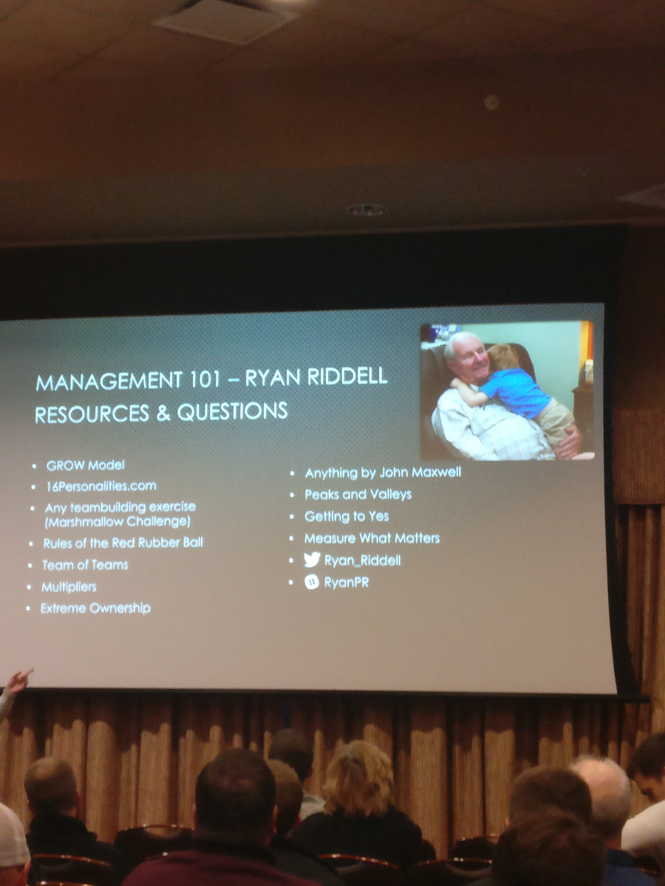

## Overview
1. Communication and Trust
1. You May Not Be Qualified
1. Know Your People
1. G.R.O.W. your people

## I don't have all the answers
- There are too many different scenarios
- You'll get some things wrong
- At beginning of journey, was "below average" according to internal company management survey

## Communication and Trust
1. Engage the Experts
    - HR
    - your boss
    - Other Managers
    - Mentors
    - [58% of those surveyed trust strangers more than their manager](https://hbr.org/2016/07/a-global-survey-on-the-ambiguous-state-of-employee-trust)
        - Harvard Business Review
1. Don't make knee jerk decisions
1. Make decisions based on guidance
1. *You're* accountable for outcomes
1. You're also the owner of standards
1. For every situation, *must* consider causes and options
1. Praise more than punish
    - No one is going to have any potential at work if they're crying.

## You May Not Be Qualified
1. If you can't sit down with someone and say *today will be your last day at CompanyCorp*, you aren't qualified
1. If you are excited by the prospect of *power over your peers*, you aren't qualified

## Know Your People
- if you want to build a *command*, you just need more people.  If you want a *team*, you need to know your people

- Do personality tests!
- Ask where they're from!

## G.R.O.W. your people
1. **G**oals
1. **R**eality (Starting Point)
1. **O**ptions (Strategic)
1. **W**ay Forward (Tactical)

Let your person talk about this.

hypothetical:
1. Employee wants to be at <dev-level-next>
    - Scale of 1-10:  1 is "nowhere close", 10 is "should have already been promoted"
    - If employees feels they are at an 8, and you are at a 4, don't react with exasperation

<!-- ## The Real Lesson
Back Story
- Management is complex, not complicated -->

## Resources
[Rules of the Red Rubber Ball](https://www.amazon.com/Rules-Red-Rubber-Ball-Sustain/dp/1933060026)

