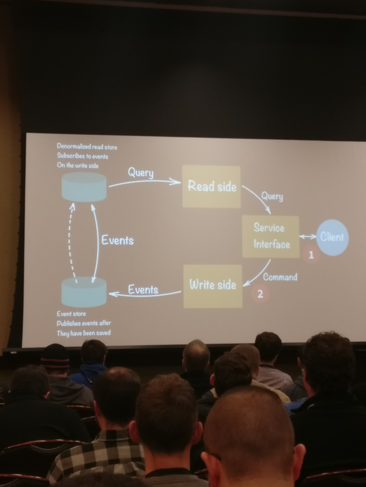
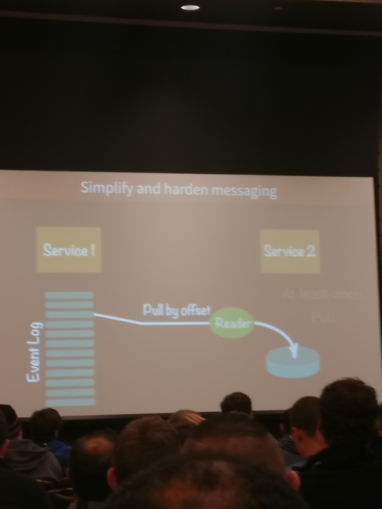

# Why-your-microservices-should-use-event-sourcing-and-cqrs
## System of loosely coupled services
1. Independently deployable
1. **Owns its own schema**
1. API-only access to data

### What is CQRS?
- **C**ommand
- **Q**uery
- **R**esponsibility
- **S**eparation
- [What Martin Fowler has to say](https://martinfowler.com/bliki/CQRS.html)

Preserves the **events** that act on the data store. The "sum" of events = the current state of the store
- i.e. `ADD_ITEM` + `UPDATE_ITEM` + `DELETE_ITEM` = row removed

## Reason 1: Smooth transition from Domain Driven Design and Event Storming to implementation

## Reason 2: Reduce service coupling
- Reduce "blast area" if (when) services go down.
- Allows us to track "sagas" across distributed systems
    - if (when) things break, easier to recreate bad state

## Reason 3: break `read` vs `write` performance tradeoff
- decouples "read" and "write" operations
- "slice" of state is pulled from events to generate read.  this is the [eventual consistency](https://en.wikipedia.org/wiki/Eventual_consistency) phenomena

## Reason 4: "Raise" concurrency barrier
- speaker was unclear as to what this meant

## Reason 5: Simplify and Harden messaging
- types of messaging (they're both "maybe-once")
    - at-least-once
    - exactly-once

## Reason 6: Eliminate Service Coupling
## Reason 7: Graduate from the IT nursery
- Reduces ceremony and ritual 
- gives capability to self-correct
- increase velocity